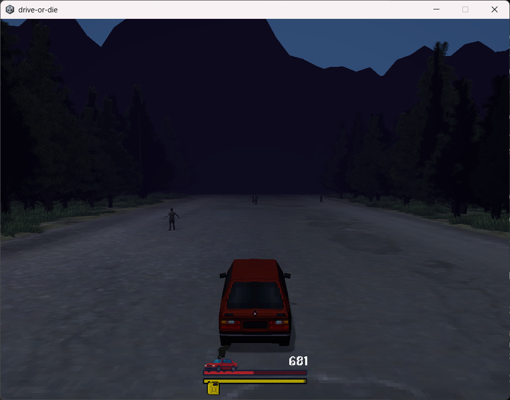
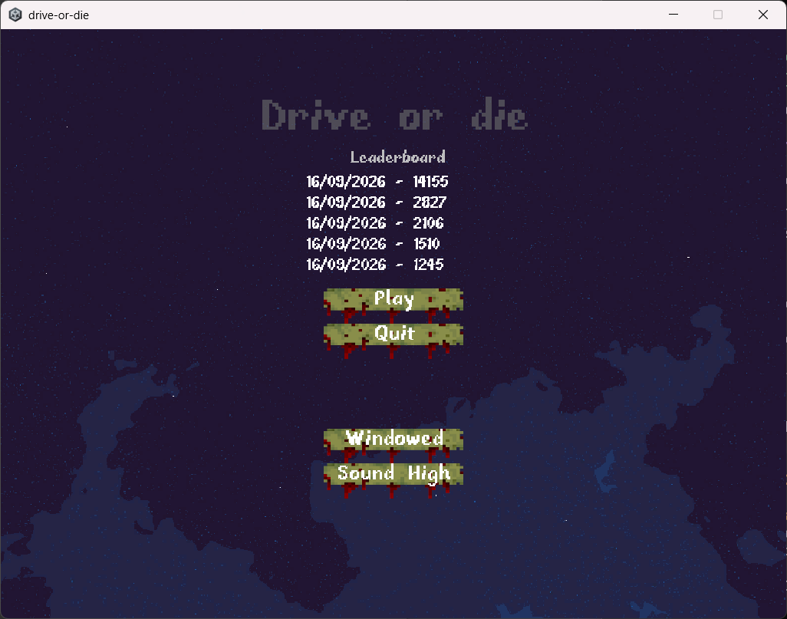
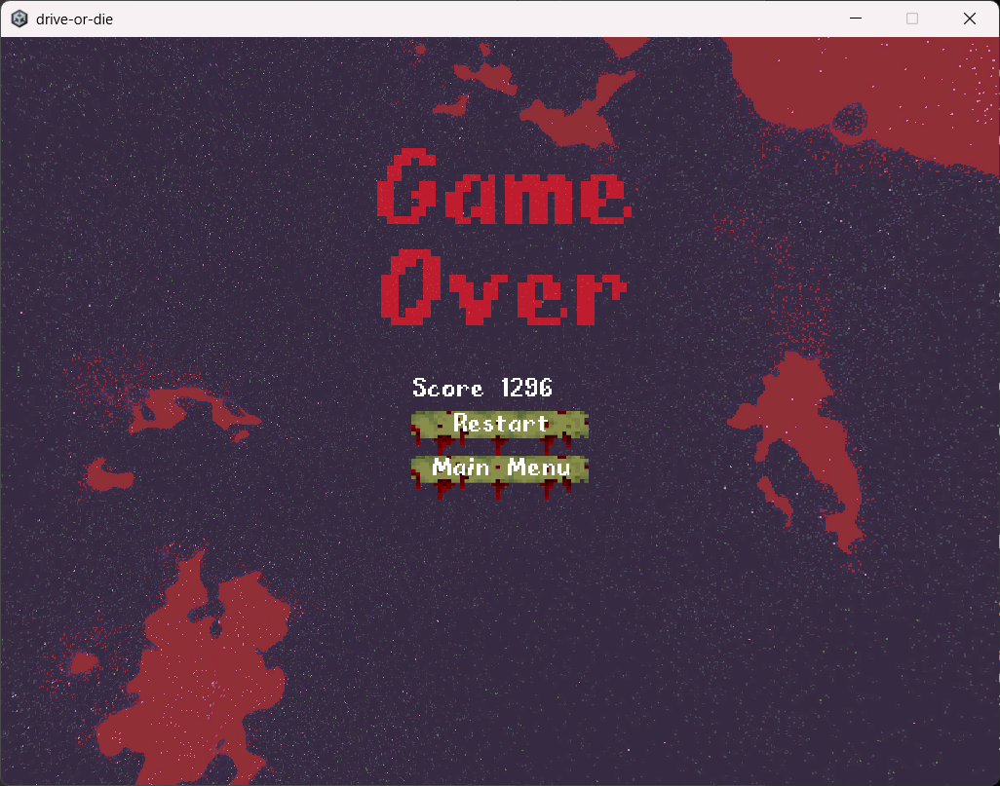
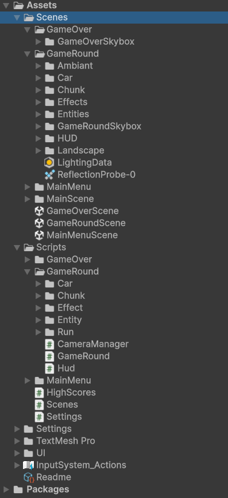

# Documentation Technique

**Jeu vidéo PC :** Drive or Die
**Développeur :** [Nom / Prénom]
**Promotion :** [Promo / Année]
**Version :** 1.0

---

## Sommaire

1. Introduction
2. Fiche technique
3. Description et fonctionnement du jeu
4. Architecture du code
5. Organisation du travail
6. Nomenclature et bonnes pratiques
7. Méthode de test
8. Historique des features et évolutions
9. Ressources et crédits

---

## 1. Introduction

### 1.1 État du projet

Le projet en est au stade de prototype, version zéro. L'objectif : poser une petite architecture solide pour pouvoir itérer dessus, et surtout obtenir une première boucle de gameplay complète. Les mécaniques globales sont implémentées, une première phase d'équilibrage a été faite, succincte et à retravailler largement. L'inventaire d'items tenus est architecturé mais pas encore alimenté : les hooks existent et sont câblés dans la run, aucun code n'ajoute encore d'item à la liste.

Les modèles, sons et autres assets sont gratuits, sous licence CC0 (domaine public) : ils ne sont là que pour couvrir le visuel du prototype, pas pour définir une identité. Le prototype n'est pas destiné à sortir d'un cercle très fermé, les artistes ne sont donc pas crédités ici.

### 1.2 Préambule : la place de l'IA

L'architecture et l'implémentation de ce projet sont faites à la main. L'IA n'intervient que comme assistant : documentation, noms de variables, commentaires et mise en forme du code. C'est surtout sur la documentation et la rédaction que je l'ai beaucoup utilisée — du fait de ma dyslexie, elle m'aide à rédiger et corriger ce document.

---

## 2. Fiche technique

* **Nom du jeu :** Drive or Die
* **Genre :** Infinite Runner 3D post-apocalyptique
* **Moteur / Version :** Unity 6 (6000.3.19f1)
* **Pipeline de rendu :** Universal Render Pipeline (URP 17.3)
* **Système d'input :** Input System (1.19)
* **Langage :** C#
* **Plateforme cible :** PC
* **Versioning :** Git, dépôt local hébergé sur un serveur NAS — test direct sur deux machines : le PC de développement et un portable bas de gamme dédié aux tests de performance
* **Durée de développement :** 1 mois

---

## 3. Description et fonctionnement du jeu

### Principe

*Résumé du GDD, à destination des développeurs.*

Drive or Die est un infinite runner post-apocalyptique. Le joueur est au volant d'une voiture qui roule toujours tout droit : il tient le braquage latéral, rien d'autre. La caméra est une vue à la troisième personne, derrière la voiture, qui la suit en permanence.



### Objectif

Faire le meilleur score. Le jeu est itératif : chaque partie est une tentative de battre son record.

### Les deux jauges

La voiture vit sous deux jauges :

- Santé : la voiture se dégrade.
- Essence : la voiture consomme du carburant pour rouler.

Quand l'une des deux tombe à zéro, c'est game over. Ce sont les deux seules conditions de défaite.

### Les éléments de la route

La route est parsemée de différents éléments, dont voici des exemples :

- Les items de soin : foncer dedans répare la voiture.
- Les items d'essence : ils rajoutent du carburant.
- Les obstacles : zombies, carcasses de voitures...

### Le décor

Le décor (arbres, herbe, jusqu'aux animaux) ne passe pas par des prefabs : il vit sous le **Terrain** d'Unity, qui place herbe et environnement en masse sans coût par objet. Les entités de gameplay, elles, restent des prefabs poolés. Le choix est venu des tests de performance sur la machine bas de gamme : les prefabs de décor y faisaient tomber le jeu sous le seuil de jouabilité (voir Rapport de Tests, §5).

### La partie role play

Le GDD contient une partie role play (lore, narration). Elle n'est pas implémentée dans le prototype : l'objectif est la jouabilité, uniquement.

### Contrôles

Un seul contrôle : le braquage, sur l'axe X d'une action d'input 2D (Input System). La vitesse avant n'est pas un contrôle : elle vient du monde, qui glisse vers la voiture. Échap met la run en pause (panneau pause, `Time.timeScale` à 0).

### HUD et caméra

Le HUD affiche deux barres — santé et essence — dont la largeur suit le ratio de chaque jauge, plus le score courant. Le Canvas passe par le mode **Scale With Screen Size** : l'interface suit la taille de l'écran et garde ses proportions quelle que soit la résolution. La caméra, en vue troisième personne derrière la voiture, couple position et FOV sur la même difficulté — une position initiale et une finale (`(0, 6, -12)` vers `(0, 9, -20)`), une FOV initiale et une finale (60° → 70°) — avec un lissage `SmoothDamp`.

### Score et équilibrage

Le `RunManager` fait avancer la run par ticks (trois ticks par seconde) :

- **Score** : à chaque tick, le score avance de la vitesse courante — il grandit donc comme la distance parcourue.
- **Vitesse** : elle passe de 20 à 60 m/s au fil de la difficulté (`Difficulty` = ticks écoulés / 1800, soit 10 minutes à 3 ticks/s).
- **Essence** : consommation par tick proportionnelle à la vitesse courante (`_fuelPerTick × vitesse`) — elle brûle d'autant plus vite que la voiture va vite.
- **Bornes** : santé et essence plafonnées à 100, clampées à l'application ; game over dès que l'une passe à 0.

Les items d'inventaire tenus par la run ajustent le score via leur hook `OnScore` avant application (système câblé mais non alimenté dans le prototype — voir §1.1).

### Scènes et flux de jeu

Trois scènes composent la boucle de jeu, nommées par un `Scenes.cs` unique qui reflète les build profiles : `MainMenuScene`, `GameRoundScene`, `GameOverScene`.

- Le Main Menu envoie vers la Game Scene.
- La Game Scene envoie vers le Main Menu ou le Game Over.
- Le Game Over envoie vers le Main Menu ou la Game Scene.

**Main Menu** — quatre choses :

- Un bouton Play, qui lance la Game Scene.
- Un bouton Quitter.
- Le leaderboard, chargé depuis un fichier JSON persistant.
- Les réglages : un bouton de volume cyclique (Off / Faible / Moyen / Élevé) et un toggle plein écran, persistés en `PlayerPrefs`.



**Game Scene** — la run, ses jauges et son HUD ; un panneau pause couvert par Échap ; à la défaite, le score transite par un `RunResult` statique puis la scène bascule vers le Game Over.

**Game Over** — trois choses :

- Le score de la run qui vient d'être perdue, flaggé "(new)" quand il bat le record.
- Un bouton Retry, qui relance la Game Scene.
- Un bouton Main Menu.



---

## 4. Architecture du code

### L'organisation des assets

L'arborescence n'est pas triée par type d'asset — pas de dossiers globaux `Materials/`, `Textures/` ou `Prefabs/` — mais par composant, en miroir du code : tout ce qui appartient à un élément vit dans son dossier.

`Assets/` tient en cinq dossiers :

- **`Scenes/`** : un dossier par scène (`MainMenu/`, `GameRound/`, `GameOver/`). L'arborescence interne de la scène de jeu répète le découpage du code — `Car/`, `Chunk/`, `Entities/`, `Effects/`, `HUD/`, le décor sous `Chunk/Terrain/`.
- **`Scripts/`** : le code, même découpage (détail plus bas).
- **`Settings/`** : la configuration du moteur — les assets URP (variantes PC et Mobile), l'audio mixer, les profils de post-traitement.
- **`UI/`** : ce qui est partagé entre les scènes — le bouton (sprite et prefab côte à côte), les polices.
- **`TextMesh Pro/`** : l'import standard du package.

Chaque feuille est auto-contenue : le dossier d'un zombie réunit son modèle, sa texture, son matériau, son prefab et son asset `EntityDescription` ; celui d'un effet de sang, son prefab, son sprite, son son et son `EffectDescription`. Déplacer ou retirer un composant revient à déplacer un dossier. Les seules dépendances restent déclarées — un prefab pointe son matériau, une description pointe son prefab — jamais dispersées.

### Le code

Le code vit dans `Assets/Scripts/`. Trois helpers globaux à la racine : `Scenes.cs` (les noms de scènes), `HighScores.cs` (le leaderboard) et `Settings.cs` (volume et plein écran, persistés en `PlayerPrefs`). Le cœur du jeu vit dans `Assets/Scripts/GameRound/`, découpé en modules : `Chunk/` (la route et sa génération), `Entity/` (les éléments posés sur la route), `Car/` (le véhicule du joueur), `Run/` (l'état de la run) et `Effect/` (le feedback des collisions). Les types concrets d'entités (`InstantHeal`, `InstantFuel`, `InstantDamage`) vivent dans `Entity/Entities/`. Les écrans hors jeu ont leurs dossiers : `MainMenu/` et `GameOver/`.



### Monde et chunks

La route infinie repose sur des chunks : des segments de route recyclés en boucle. Le code vit dans `Assets/Scripts/GameRound/Chunk/`.

#### Principe

Le `ChunkManager` maintient un ring de chunks devant la voiture. Le monde glisse vers l'arrière ; quand le chunk de tête passe derrière la voiture, son contenu est libéré dans les pools et le chunk est replacé en fin de file, puis re-seedé.

#### Chunk et ChunkZone

`Chunk` est le MonoBehaviour d'un segment de route :

- `Zone` : la `ChunkZone` du prefab.
- `Entities` : les entités rattachées au chunk.
- `Length` : la longueur du chunk, dérivée de la profondeur de la zone (`Zone.Max.y - Zone.Min.y`).

`ChunkZone` définit la zone de spawn dans le repère du marqueur — l'objet de scène placé dans le prefab de chunk :

- `Min` / `Max` : le rectangle horizontal.
- `Altitude` : la hauteur de base.

C'est le marqueur qui commande tout : son rectangle sert à diviser la zone en cellules, et son tilt/rotation se répercute sur la position des entités. Un gizmo jaune (`OnDrawGizmosSelected`) le dessine dans l'éditeur.

#### ChunkManager

Le composant qui orchestre tout.

Paramètres :

- `AheadChunks` : nombre de chunks maintenus devant la voiture.
- `ChunkPrefab` : le prefab de chunk instancié.
- `Entities` : la base globale des descriptions d'entités.
- `XCells` / `YCells` : la zone est divisée en une grille de cette taille.
- `Tries` : essais de placement par entité.
- `Border` : marge entre deux entités voisines.
- `MinTarget` / `MaxTarget` : budget d'entités par chunk, interpolé selon la difficulté de la run.
- `_emptyChunksAtStart` : chunks vides au lancement, pour démarrer sur une route dégagée — le joueur ne peut pas se prendre un dégât avant d'avoir pu bouger.

Cycle de vie :

- Au lancement (`OnEnable`), les `AheadChunks` chunks sont créés et seedés d'un coup ; le recyclage ne démarre qu'une fois le ring rempli (`_initialized`).
- Chaque frame, tout le monde glisse vers l'arrière à la vitesse de la voiture.
- Quand le chunk de tête passe derrière le zéro local, ses entités sont libérées (`Description.Release`, en parcourant la liste à l'envers), puis le chunk repart en queue via `NewChunk`.
- `CreateChunk` instancie le prefab.

Génération du contenu (`NewChunk`) :

Chaque chunk re-seedé reconstruit sa liste de blueprints :

1. Chaque description de la base devient un `EntityBlueprint`, dont le poids interpole entre `MinWeight` et `MaxWeight` selon la difficulté.
2. `FilterBlueprint` est appliqué sur chaque blueprint (vide pour l'instant, prévue pour les filtres futurs).
3. Les items de l'inventaire de la run ajustent les poids via leur hook `OnEntityBlueprint`.
4. Les blueprints de poids ≤ 0 sont jetés.
5. Le total des poids sert au tirage pondéré (`DrawBlueprint`).

Placement (dart throwing, une variante de poisson-disque sur grille) :

- Le chunk doit recevoir `Target` entités. Pour chacune, on tire une cellule de la grille au hasard, avec `Tries` essais si elle est occupée. Une cellule, une entité.
- La grille est une liste plate (index = `row * cols + col`), allouée une fois et vidée à chaque chunk : zéro allocation.
- Chaque rangée est décalée latéralement d'au plus une cellule : sans ça, les entités s'aligneraient en colonnes visibles. La colonne du bord, côté décalage, est vidée pour que rien ne dépasse de la route.
- Une fois la grille remplie, la conversion en positions : jitter dans la cellule, réduit de `Border` (deux voisines jamais plus proches que `2 × Border`), altitude de la zone, transform du marqueur vers celui du chunk.
- Rotation aléatoire sur Y pour chaque entité.

#### Pourquoi cette architecture

- **Zéro GC** : le ring recycle les chunks et la grille est réutilisée. Après le lancement, plus rien n'est créé ni détruit en jeu.
- **Répartition naturelle** : le dart throwing donne un aléatoire sans amas ni alignements, à coût constant. Un tirage naïf par position produirait des chevauchements et des rangées denses.
- **Jouabilité garantie** : espacement minimal et interdiction de déborder de la route, sans post-traitement.
- **Difficulté par la donnée** : la difficulté ne courbe que deux nombres, le budget (densité) et les poids (fréquences). Tout le tuning se fait dans les assets (`MinWeight`/`MaxWeight`).
- **Contenu découplé du terrain** : ajouter un variant de chunk se résume à un prefab avec son marqueur ; la génération ne connaît pas les prefabs, elle lit la zone.
- **Chunks indépendants** : chaque chunk est seedé sans dépendance vis-à-vis de ses voisins, donc recyclable n'importe où dans le ring.

### Entités

Tout ce qui se trouve sur la route est une entité : items de soin, jerricans d'essence, zombies, carcasses de voiture... Le code vit dans `Assets/Scripts/GameRound/Entity/`.

Le système est data-driven : chaque type d'entité est une asset qui décrit tout ce qu'il y a à savoir sur elle, et le runtime ne manipule que ces données.

#### EntityDescription

Le cœur du système : une classe abstraite héritant de `ScriptableObject`. Chaque type d'entité correspond à une asset qui porte toutes ses données.

D'un côté les données d'affichage :

- `Description` : le texte descriptif.
- `Icon` : l'icône.
- `Prefab` : ce qui est instancié en jeu.
- `Effects` : les effets visuels associés.

De l'autre les stats de gameplay :

- `MinWeight` / `MaxWeight` : bornes du poids d'apparition. Le poids effectif interpole entre les deux selon la difficulté de la run.
- `Radius` : le rayon de l'entité.

Le pooling est géré par la description elle-même, via une stack de `GameObject`s :

- `Spawn(position, chunk)` dépile une instance libre, ou instancie le prefab — toujours sous le transform du chunk — puis l'active et renvoie son composant `Entity`. La pile peut survivre au changement de scène : les instances détruites sont éliminées au dépilement, jusqu'à retrouver une instance vivante.
- `Release(entity)` fait l'inverse : détache l'entité de son chunk (elle ne peut donc jamais être libérée deux fois), désactive le GameObject, rempile.

Enfin, quatre hooks virtuels, no-op par défaut, servent de point d'extension :

- `OnEntityBlueprint` : appelé pendant la génération, pour ajuster le poids du blueprint.
- `OnCollide` : appelé quand le joueur touche l'entité.
- `OnInventory` : appelé quand un item équipé modifie la run.
- `OnScore` : appelé sur le score.

Chaque sous-classe définit son comportement en modifiant le `TempState` reçu par référence.

#### Entity

Le composant MonoBehaviour monté sur chaque instance en scène. Il ne porte aucune logique, juste deux références : `Description` (d'où vient l'instance) et `Chunk` (où elle se trouve).

#### EntityBlueprint

Une struct légère : un poids courant (après filtres et difficulté) et une référence vers la description. C'est la représentation intermédiaire entre la liste globale d'entités et le spawn effectif — la génération manipule des blueprints, jamais des GameObjects.

#### Entities

Un ScriptableObject contenant la liste globale des descriptions. C'est la source unique que la génération parcourt.

#### Un exemple concret : InstantDamage

`InstantDamage` hérite d'`EntityDescription`, expose un champ `_damage` et surcharge `OnCollide` pour décrémenter `delta.Health`. C'est tout ce qu'il faut pour faire une entité : une asset et un hook.

```csharp
[CreateAssetMenu(menuName = "Entities/Instant Damage")]
public class InstantDamage : EntityDescription
{
    [SerializeField] private int _damage;

    public override void OnCollide(ref TempState delta)
    {
        delta.Health -= _damage;
    }
}
```

#### Pourquoi cette architecture

- **Data-driven** : ajouter une entité dont le comportement est déjà couvert ne demande aucun code, juste une asset dans l'éditeur.
- **Extensible** : un comportement particulier se fait en surchargeant un hook dans une sous-classe, sans toucher à la génération ni au gameplay.
- **Découplé** : la donnée (`EntityDescription`), l'instance en scène (`Entity`) et le blueprint de génération (`EntityBlueprint`) sont trois objets distincts ; la génération travaille sur des objets légers.
- **Performant** : le pooling évite les instanciations/destructions répétées, point sensible pour un runner qui spawne en continu.
- **Local** : les entités vivent dans leur chunk, libérer un chunk libère tout son contenu sans connaître chaque entité.

### La voiture

Le code vit dans `Assets/Scripts/GameRound/Car/`.

#### Principe

La voiture n'a qu'un contrôle : la direction. La vitesse avant ne lui appartient pas — c'est le monde qui glisse vers elle. Physiquement, son Rigidbody ne fait que tourner en yaw et glisser latéralement. Ses contraintes le garantissent : rotation gelée hors de l'axe Y, position avant gelée — et son **interpolation** lisse le rendu des contacts contre les bords latéraux de la route.

#### Car

`Car` est le composant principal, monté sur un Rigidbody.

Ses références : l'action d'input de déplacement (l'axe X sert au braquage), le `RunManager` qui porte l'état de la run, les transforms des quatre roues et de la carrosserie. L'état de la run vit dans le `RunManager`, la voiture expose juste `ForwardSpeed` en passthrough.

Direction (`FixedUpdate`) :

1. L'input brut de l'axe X est lissé via `MoveTowards` : le braquage n'est pas instantané.
2. L'angle de braquage maximal est dynamique, il descend avec la vitesse (de `_maxDiagonalAngle` = 25° vers sa moitié) : plus on va vite, moins on est maniable.
3. `SmoothDampAngle` amène l'angle courant vers sa cible, borné par la vitesse angulaire maximale issue de la géométrie du véhicule — un bicycle model simplifié : `ForwardSpeed × tan(angle roue) / empattement`, avec un empattement de 2,5 m et des roues braquant jusqu'à 35°.
4. La vitesse angulaire Y est posée directement sur le Rigidbody, avec un realignement : une collision décale le yaw réel, l'erreur décroît à chaque tick (`RealignSpeed` = 8) vers l'angle de braquage.
5. La vitesse latérale vaut `ForwardSpeed × tan(angle)` ; les composantes verticale et avant du Rigidbody sont conservées.

Visuel (`Update`) :

- Les roues avant tournent selon la vitesse angulaire courante (`atan(ω × empattement / vitesse)`) ; les arrière restent droites.
- Toutes les roues roulent en continu : `vitesse × dt / rayon de roue`.
- La carrosserie prend un roll proportionnel à l'angle des roues et à la vitesse, plus un shake de bruit de Perlin en rotation Z et position Y, qui s'accélère avec la vitesse. C'est ce shake qui donne la sensation de vitesse.

Collisions (`OnTriggerEnter`) :

1. Un `TempState` est réinitialisé (une seule instance, réutilisée : aucune allocation par collision), puis l'entité touchée y applique ses dégâts via `OnCollide`.
2. Les items de l'inventaire de la run ajustent le delta via `OnInventory`, avant application.
3. `RunManager.Apply(ref _delta)` applique le tout à l'état de la run.
4. Les effets de l'entité spawnent à sa position, attachés à son chunk : ils glissent avec le monde et survivent à l'entité.
5. L'entité retourne dans son pool.

#### TempState

Une struct simple : `Car`, `MaxHealth`, `MaxFuel`, `Health`, `Fuel`, `Distance`, `Score`, plus un `Reset`. C'est la monnaie d'échange des hooks : chaque hook reçoit le delta par référence et le modifie, et seul `RunManager.Apply` l'applique réellement — clampé, pour qu'aucun appelant ne puisse pousser les jauges hors bornes.

### La caméra

#### CameraManager

Le composant monté sur la caméra. Ses références : le transform de la voiture et le `RunManager`. À chaque `LateUpdate` :

- L'offset interpole entre `_offsetMin` `(0, 6, -12)` et `_offsetMax` `(0, 9, -20)` selon la difficulté de la run.
- La position cible est celle de la voiture plus cet offset ; `SmoothDamp` (0,15 s) lisse la poursuite.
- La FOV interpole de 60° à 70° sur la même difficulté.

La caméra ne connaît ni chunks ni entités : elle lit un seul nombre, la difficulté, et cadre en conséquence.

### La run

#### RunManager

Le propriétaire unique de l'état de la run. Le code vit dans `Assets/Scripts/GameRound/Run/`.

- **Tick** : la run avance par intervalles fixes (trois fois par seconde), indépendamment du framerate.
- **Difficulté** : un curseur `Difficulty` (ticks écoulés / 1800) que lisent le `ChunkManager` (poids et budget), la vitesse et la caméra.
- **Vitesse** : `ForwardSpeed` interpole de 20 à 60 m/s selon la difficulté.
- **Stats** : santé, essence, score, distance ; toute modification passe par `Apply(ref TempState)` qui clamp les jauges.
- **Inventaire** : la liste des entités tenues ; leurs hooks `OnScore` ajustent le tick, leurs hooks `OnEntityBlueprint` courbent la génération, leurs hooks `OnInventory` ajustent les collisions.
- **Fin de run** : `IsOver` dès que santé ou essence tombe à 0.

#### RunResult

Une classe statique minimale qui transporte le score de la run terminée à travers le changement de scène : la Game Scene l'écrit, le Game Over le lit et l'affiche.

### Effets

Le feedback des collisions : quand la voiture touche une entité, ses effets spawnent à sa position. Le code vit dans `Assets/Scripts/GameRound/Effect/`, calqué dans les grandes lignes sur celui des entités.

#### EffectDescription

Un ScriptableObject qui porte le prefab d'effet et son propre pool (`Stack<Effect>`) :

- `Spawn(position, parent)` dépile une instance libre, ou instancie le prefab, le place, l'active et lance la lecture.
- `Release(effect)` désactive et rempile.

#### Effect

Le composant en scène : un ParticleSystem et une AudioSource optionnels. Il se libère tout seul — dès que ses particules sont mortes et son audio terminé, il retourne dans le pool de sa description. Attaché au chunk de l'entité touchée, un effet glisse avec le monde et survit à l'entité qui l'a déclenché.

### Interface, flux et sauvegarde

#### GameRound

Le cerveau unique de la Game Scene : la run tick par elle-même, l'input Échap bascule la pause (`Time.timeScale`), et la défaite expédie le score dans `RunResult` puis charge le Game Over — une seule fois, le tempscale remis à 1.

#### Hud

Deux barres (santé, essence) dont le foreground garde son ancrage à gauche : seule sa largeur suit le ratio de la jauge. Plus le score courant, formaté sans décimales.

#### MainMenu et GameOver

Le Main Menu affiche le leaderboard formaté, Play charge la Game Scene, Quitter ferme l'application. Le Game Over lit le score de la run, le flag "(new)" s'il bat le record, et propose Retry ou retour menu.

#### HighScores

Le leaderboard, statique : les meilleures runs à travers les sessions, dans un petit fichier JSON (`highscores.json`) sous le chemin de données persistant, plafonné aux cinq meilleurs scores.

- `Load()` : renvoie une liste vide si le fichier n'existe pas — ou s'il est illisible (JSON corrompu ; la prochaine `Submit` le réécrit proprement).
- `BestScore()` : le record courant, zéro si le tableau est vide.
- `Format()` : le tableau en texte lisible, `date - score` par ligne.
- `Submit(score)` : ajoute l'entrée datée, trie décroissant, plafonne à cinq, écrit en JSON lisible.

---

## 5. Organisation du travail

Le développement s'est déroulé en phases successives, chacune validée en jouant avant de passer à la suivante.

* **Phase 1 — La voiture et le game feel :** poser la voiture et ses comportements, avec de faux chunks. Aucune génération : il s'agissait uniquement de ressentir ce que faisait la voiture (braquage lissé, sensation de vitesse).
* **Phase 2 — La génération des chunks, à vue :** trois itérations — un remplissage par Perlin (rejeté : performances insuffisantes et rendu médiocre), un remplissage aléatoire suivi d'une dilatation, puis le poisson-disque retenu. Les tests étaient purement visuels, via les gizmos en éditeur ; c'est là qu'est apparu l'artéfact des colonnes, corrigé par le décalage de rangées.
* **Phase 3 — La conception des entités :** conceptuelle, sans test formel. Plusieurs itérations sur le besoin : d'abord des entités indépendantes, puis le système actuel à base de ScriptableObjects. Les pools pour le recyclage sont pensés dès cette phase, pour les entités comme pour les chunks.
* **Phase 4 — Générateur et entités combinés :** le générateur de chunks réel, le recyclage du ring, et le `RunManager` qui porte l'état de la run.
* **Phase 5 — Les items :** placer les items sur la route, premier tour de gameplay complet.
* **Phase 6 — Les effets :** le constat : une collision faisait disparaître l'entité, sans rien dire. Le système d'effets est né de ce test.
* **Phase 7 — Menus et scores :** le Main Menu, le Game Over, la liaison de tout ça, et la gestion des scores enregistrés en JSON.
* **Phase finale — Peaufinage :** équilibrage et tests.

**Durée totale :** un mois.

---

## 6. Nomenclature et bonnes pratiques

* **Scripts regroupés par module :** `Assets/Scripts/GameRound/Chunk/`, `Entity/`, `Car/`, `Run/`, `Effect/`, plus les écrans `MainMenu/` et `GameOver/`.
* **Classes et composants :** PascalCase (`Car`, `ChunkManager`, `EntityDescription`).
* **Champs privés sérialisés :** préfixés d'un underscore (`_damage`, `_maxDiagonalAngle`, `_emptyChunksAtStart`).
* **Structs de données simples :** `TempState`, `EntityBlueprint`.
* **Points d'extension :** hooks virtuels nommés `OnXxx` (`OnCollide`, `OnInventory`, `OnScore`, `OnEntityBlueprint`).
* **Helpers et état inter-scènes :** classes statiques (`Scenes`, `HighScores`, `RunResult`).
* **Composants sans logique :** les MonoBehaviours porteurs de pur état (`Entity`) n'exposent que des références.
* **Un seul point d'application :** toute modification de stat transite par `RunManager.Apply`, clampé.
* **Indentation :** quatre espaces, accolade ouvrante à la ligne.
* **Pas d'espaces de noms :** le dossier remplace le namespace — la hiérarchie `Assets/Scripts/` tient lieu de frontière.
* **Visibilité :** privé par défaut ; l'inspecteur passe par `[SerializeField] private`, jamais par des champs publics de confort.
* **Commentaires :** rares et utiles — ils expliquent le pourquoi, pas le comment ; les noms explicites font le reste.

---

## 7. Méthode de test

Approche fonctionnelle manuelle, intégrée au fil du développement, phase par phase : chaque phase se validait en jouant avant d'attaquer la suivante. Les gizmos en éditeur ont servi aux tests visuels de la génération ; les performances ont été mesurées au Profiler, sur build, sur le portable bas de gamme.

*(Détail complet disponible dans le document séparé : **Rapport de Tests**.)*

---

## 8. Historique des features et évolutions

* **Génération, trois itérations :** Perlin (rejeté — performances et rendu), remplissage aléatoire + dilatation, puis poisson-disque retenu.
* **Direction, deux versions :** pivot proportionnel à la vélocité latérale (rejeté — sensation de glisse "en crabe"), puis bicycle model simplifié lissé par `SmoothDampAngle`.
* **Rigidbody de la voiture :** contraintes ajoutées (déplacements parasites contre les bords latéraux), puis interpolation (tremblement au contact des murs).
* **Décalage de rangées :** correction de l'artéfact des colonnes visibles, suite au test visuel en gizmos.
* **Entités, deux versions :** d'abord indépendantes, puis le système data-driven à ScriptableObjects.
* **Système d'effets :** ajouté après le constat qu'une collision ne disait rien.
* **Décor :** prefabs aléatoires (arbres, herbe, poules...) rejetés sur la machine bas de gamme — passage au Terrain d'Unity.
* **Protection du spawn :** les deux premiers chunks sont générés sans entités — plus de dégât pris avant le premier contrôle.
* **Caméra :** position et FOV couplées à la difficulté, suite au test de la difficulté maximale.
* **HUD :** Canvas Scaler en mode Scale With Screen Size.
* **Réglages :** volume cyclique et plein écran, persistés en `PlayerPrefs`.
* **Optimisations :** pooling des entités et des effets, ring de chunks recyclé, grille de placement et delta de collision réutilisés : zéro allocation après le lancement.

---

## 9. Ressources et crédits

* **Moteur :** Unity 6
* **Modèles 3D, sons et autres assets :** assets gratuits issus d'itch.io, sous licence **CC0 1.0 Universal** (domaine public — usage commercial sans attribution obligatoire).
* **Créditation :** le prototype n'est pas destiné à sortir d'un cercle très fermé ; les artistes ne sont pas crédités individuellement (les packs sont issus d'itch.io, licence CC0 1.0 Universal).
